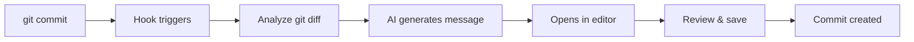

# commit-ai

> Never write a commit message again. Let AI do it for you.

[](LICENSE)
[](https://www.python.org/downloads/)

commit-ai is an intelligent git commit message generator that analyzes your staged changes and automatically creates meaningful, conventional commit messages using AI.

## ✨ Features

- 🎯 **Zero Configuration**: Works out of the box with sensible defaults
- 🤖 **AI-Powered**: Analyzes git diff to generate contextual messages
- 📝 **Conventional Commits**: Automatically follows conventional commit format
- ⚡ **Fast**: Generates messages in seconds
- 🔒 **Privacy First**: Default uses Ollama (runs locally, no API keys needed)
- 🎨 **Highly Customizable**: Templates, prompts, and formats
- 🔄 **Multi-Provider**: Supports Ollama, OpenAI, Anthropic Claude, Google Gemini
- 💾 **Per-Repo Config**: Different settings for each project

## 🎥 Demo

**Before commit-ai:**
```bash
$ git commit
[blank editor opens]
> "updated stuff"  # 😞 Useless commit message
```

**After commit-ai:**
```bash
$ git commit
[editor opens with:]
feat(auth): add JWT validation middleware

Implements JWT-based authentication middleware to validate user
tokens on protected routes. Includes error handling for expired
and invalid tokens to improve security.

# ✨ You can edit if needed, or just save!
```

## 🚀 Quick Start

### One-Line Installation

```bash
curl -fsSL https://raw.githubusercontent.com/hassan/commit-ai/main/install.sh | bash
```

### Manual Installation

```bash
# Clone the repository
git clone https://github.com/hassanvfx/commit-ai.git
cd commit-ai

# Install
pip3 install --user -e .

# Run setup wizard
commit-ai setup
```

### Usage

Once installed and configured:

```bash
# 1. Make changes to your code
echo "new feature" >> app.py

# 2. Stage changes
git add app.py

# 3. Commit (commit-ai generates the message automatically!)
git commit

# Your editor opens with an AI-generated commit message
# Review, edit if needed, and save!
```

## 📋 Requirements

- Python 3.8+
- Git
- One of the following AI providers:
  - **Ollama** (recommended - free, local, no API key) - [Install](https://ollama.ai)
  - **OpenAI** (requires API key)
  - **Anthropic Claude** (requires API key)
  - **Google Gemini** (requires API key)

## 💡 How It Works



1. You run `git commit`
2. The prepare-commit-msg hook triggers
3. commit-ai analyzes your staged changes
4. AI generates a contextual commit message
5. Message opens in your editor for review
6. Save and your commit is created!

## 🎮 Commands

### Setup & Installation

```bash
commit-ai setup          # Interactive setup wizard
commit-ai install        # Install hook in current repository
commit-ai uninstall      # Remove hook from current repository
```

### Testing & Debugging

```bash
commit-ai test           # Test message generation without committing
commit-ai doctor         # Diagnose setup issues
commit-ai provider test  # Test AI provider connection
```

### Configuration

```bash
commit-ai config                           # Show current configuration
commit-ai config set <key> <value>         # Set a config value
commit-ai config get <key>                 # Get a config value

# Examples:
commit-ai config set openai.api_key sk-...
commit-ai config set commit_format.max_title_length 80
```

### Provider Management

```bash
commit-ai provider                    # List available providers
commit-ai provider switch <name>      # Switch AI provider
commit-ai provider test               # Test current provider

# Examples:
commit-ai provider switch openai
commit-ai provider switch ollama
```

## ⚙️ Configuration

Configuration is stored in `commit-ai.conf` at your repository root.

### Default Configuration

```json
{
  "enabled": true,
  "ai_provider": "ollama",
  "providers": {
    "ollama": {
      "enabled": true,
      "base_url": "http://localhost:11434",
      "model": "llama2:7b-chat"
    },
    "openai": {
      "enabled": false,
      "api_key": "",
      "model": "gpt-4"
    }
  },
  "commit_format": {
    "use_conventional_commits": true,
    "types": ["feat", "fix", "docs", "style", "refactor", "test", "chore", "perf"],
    "max_title_length": 72,
    "include_body": true
  },
  "analysis": {
    "max_diff_lines": 500,
    "include_file_list": true
  }
}
```

### Customizing Prompts

You can customize how the AI generates commit messages:

```json
{
  "prompt_engineering": {
    "system_message": "You are an expert at writing clear git commits...",
    "reasoning_template": "Analyze these changes step by step...",
    "examples": [
      {
        "diff": "Added user authentication",
        "output": "feat(auth): add user authentication system"
      }
    ]
  }
}
```

## 🔌 AI Providers

### Ollama (Recommended)

**Free, local, no API key needed**

```bash
# Install Ollama
curl -fsSL https://ollama.ai/install.sh | sh

# Pull a model
ollama pull llama2:7b-chat

# Configure commit-ai
commit-ai setup  # Select Ollama
```

**Recommended models:**
- `llama2:7b-chat` - Default, good balance
- `codellama:7b` - Better for code
- `mistral:7b` - Fast and accurate

### OpenAI

```bash
# Set API key
commit-ai config set openai.api_key sk-your-key-here

# Switch provider
commit-ai provider switch openai
```

### Anthropic Claude

```bash
# Set API key
commit-ai config set anthropic.api_key sk-ant-your-key-here

# Switch provider
commit-ai provider switch anthropic
```

### Google Gemini

```bash
# Set API key
commit-ai config set gemini.api_key your-key-here

# Switch provider
commit-ai provider switch gemini
```

## 🎯 Examples

### Feature Addition

**Changes:** Added JWT authentication middleware

**Generated:**
```
feat(auth): add JWT validation middleware

Implements secure JWT-based authentication for protected routes.
Includes token signature verification, expiration checking, and
comprehensive error handling for invalid tokens.
```

### Bug Fix

**Changes:** Fixed null pointer in user service

**Generated:**
```
fix(user): prevent null pointer exception in user service

Adds null check before accessing user object properties to
prevent application crashes when user data is not found.
```

### Documentation

**Changes:** Updated README with installation steps

**Generated:**
```
docs: update README with detailed installation instructions

Adds comprehensive installation guide including prerequisites,
step-by-step setup process, and troubleshooting tips.
```

## 🔧 Troubleshooting

### Hook not triggering

```bash
# Check if hook is installed
ls -la .git/hooks/prepare-commit-msg

# Reinstall hook
commit-ai install
```

### AI provider not working

```bash
# Diagnose issues
commit-ai doctor

# Test provider
commit-ai provider test

# Check Ollama status (if using Ollama)
ollama list
```

### Message generation fails

The tool will fall back to a simple message if AI generation fails:
```
chore: update files
```

You can customize the fallback:
```bash
commit-ai config set fallback_message "wip: changes"
```

## 📊 Conventional Commits

commit-ai follows the [Conventional Commits](https://www.conventionalcommits.org/) specification:

| Type | Description |
|------|-------------|
| `feat` | New feature |
| `fix` | Bug fix |
| `docs` | Documentation changes |
| `style` | Code style changes (formatting, etc.) |
| `refactor` | Code refactoring |
| `test` | Adding or updating tests |
| `chore` | Maintenance tasks |
| `perf` | Performance improvements |

Format: `type(scope): description`

Example: `feat(auth): add JWT authentication`

## 🤝 Contributing

Contributions are welcome! Please feel free to submit a Pull Request.

1. Fork the repository
2. Create your feature branch (`git checkout -b feature/amazing-feature`)
3. Commit your changes (`git commit -m 'feat: add amazing feature'`)
4. Push to the branch (`git push origin feature/amazing-feature`)
5. Open a Pull Request

## 📝 License

This project is licensed under the MIT License - see the [LICENSE](LICENSE) file for details.

## 🙏 Acknowledgments

- [Conventional Commits](https://www.conventionalcommits.org/)
- [Ollama](https://ollama.ai/) for local AI
- All the AI providers for making this possible

## 🌟 Star History

If you find commit-ai useful, please consider giving it a star! ⭐

## 📧 Support

- 🐛 [Report a bug](https://github.com/hassanvfx/commit-ai/issues)
- 💡 [Request a feature](https://github.com/hassanvfx/commit-ai/issues)
- 💬 [Discussions](https://github.com/hassanvfx/commit-ai/discussions)

---

**Made with ❤️ for developers who hate writing commit messages**

*Save 90 minutes per day. Focus on coding, not commit messages.*
